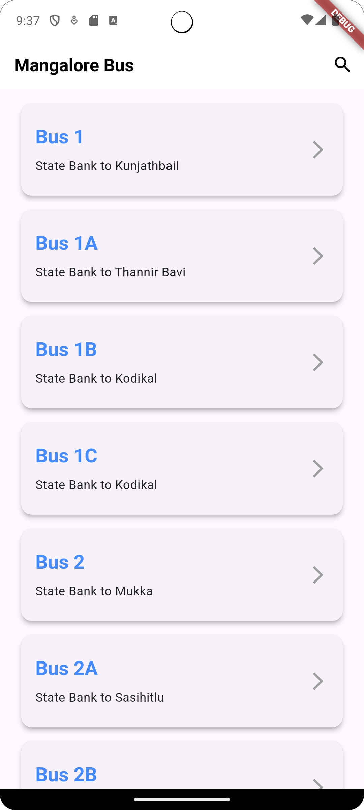
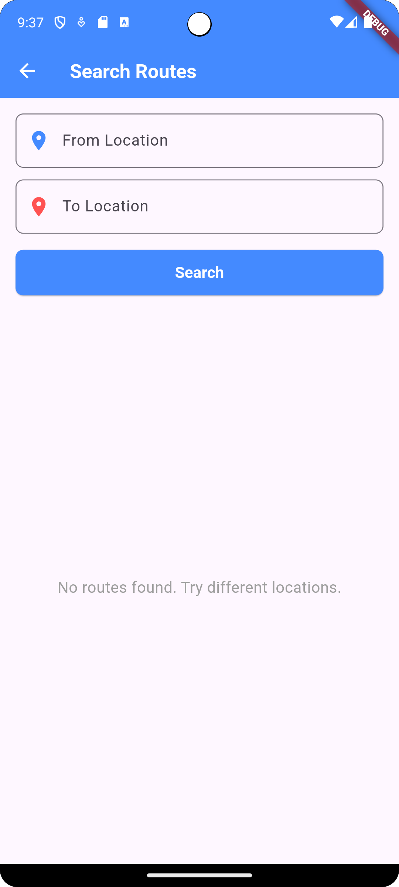
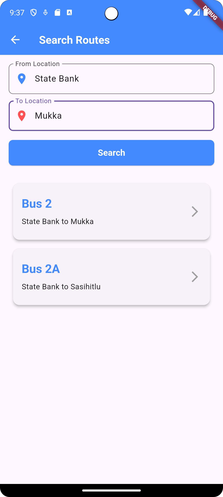
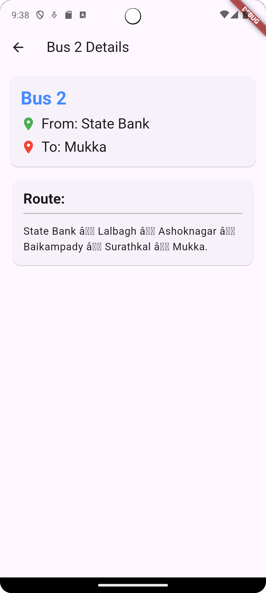

# Mangalore Bus Routes App

A Flutter application that helps users find and navigate bus routes in Mangalore. The app provides easy access to bus route information, search functionality, and detailed route views.

## Features Implemented ✅

### 1. View All Bus Routes
- Paginated list view of all available bus routes
- Each list item displays:
    - Bus number
    - Starting location
    - Destination location
- Clean and intuitive user interface
- Smooth scrolling with pagination support

### 2. Search Functionality
- Search routes by from location
- Search routes by to location
- Combined search (both from and to locations)
- Real-time search results
- Clear error handling when no routes are found

### 3. Route Details
- Detailed view for each bus route
- Complete route information including all stops
- Easy-to-read layout
- Quick access from both search results and main list

### 4. Error Handling
- Comprehensive error handling for API failures
- User-friendly error messages
- Retry functionality for failed requests
- Network connectivity error handling
- Loading states for better user experience

## Planned Features 🚀

### 1. Offline Support
- Cache frequently accessed routes
- Offline search capability
- Local storage for recent searches

### 2. User Preferences
- Save favorite routes
- Custom theme options
- Route history tracking

### 3. Enhanced Search
- Search by landmarks
- Fuzzy search for location names
- Filter routes by time of day

### 4. UI Enhancements
- Dark mode support
- Accessibility improvements
- Route sharing functionality

## Known Bugs 🐛

1. **Pagination Reset Issue**
    - Description: Sometimes the pagination count resets when returning from the search screen
    - Status: Under investigation
    - Priority: Medium

2. **Search Delay**
    - Description: Search results may take longer to load with certain combinations of locations
    - Status: Known issue
    - Priority: Low

3. **Route Display Truncation**
    - Description: Very long route descriptions might get truncated on smaller devices
    - Status: To be fixed
    - Priority: Medium

## References 📚

- [Flutter Official Documentation](https://docs.flutter.dev/)
- [Net Ninja Flutter Tutorial](https://www.youtube.com/playlist?list=PL4cUxeGkcC9jLYyp2Aoh6hcWuxFDX6PBJ)

## Screenshots and Recodring📱

[Screen Recording of the app](https://drive.google.com/file/d/1DNRf3iNIOpUogIZ8AvtjreJTzIiRWVhe/view?usp=sharing)

# App Screenshots

## Home Screen


## Search Screen


## Search Result


## Route Details


## Operating System 💻

- **Development OS**: Windows
- **Tested on**: Windows 11

## Design Tools & UI/UX Interest 🎨

- **Degisn Tools**: No specific design tools used
- **UI/UX Intrest**: Keen to explore and learn about the UI/UX domain

## Installation 🛠️

1. Clone the repository
```bash
git clone [repository-url]
```

2. Install dependencies
```bash
flutter pub get
```

3. Run the app
```bash
flutter run
```

## Project Structure 📁

```
lib/
  ├── main.dart
  ├── models/
  │   ├── bus_route.dart
  │   └── paginated_response.dart
  ├── services/
  │   └── api_service.dart
  └── screens/
      ├── home_screen.dart
      ├── search_screen.dart
      └── route_detail_screen.dart
```

## API Integration 🌐

The app integrates with the following endpoints:

[API Documentation](https://app-bootcamp.iris.nitk.ac.in/docs)

- `/bus_routes/` - Get all bus routes (paginated)
- `/bus_routes/search/` - Search routes by location
- `/bus_routes/{bus_number}` - Get specific route details

## Contributing 🤝

1. Fork the repository
2. Create your feature branch
3. Commit your changes
4. Push to the branch
5. Open a Pull Request

