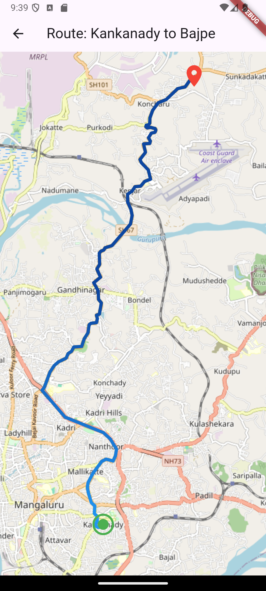

# Mangalore Bus Routes App

## Overview
The **Mangalore Bus Routes App** is a Flutter application designed to help users find bus routes in Mangalore. It allows users to search for bus routes, view route details, and display routes on a map.

---

## Features

### Implemented Features

- **Home Screen**  
  Displays a list of bus routes with options to search for specific routes.

- **Route Detail Screen**  
  Shows detailed information about a selected bus route, including the route path and an option to view the route on a map.

- **Search Screen**  
  Allows users to search for bus routes based on starting and ending locations.

- **Map Screen**  
  Displays the route on a map using FlutterMap and OpenStreetMap tiles.

### Planned Features

- **Favourite Routes**  
  Allow users to log in and save their favorite routes.

- **Offline Mode**  
  Enable offline access to previously viewed routes.

- **Route Scheduling**  
  Show bus timetables and allow users to set reminders for their trips.

- **Accessibility Features**  
  Improve accessibility for visually impaired users.

---

## Known Bugs

- **Map Loading Issue**  
  Occasionally, the map screen fails to load the route correctly.

- **Search Functionality**  
  The search feature may return inaccurate results for certain locations.

- **API Rate Limiting**  
  The app may experience delays or failures due to API rate limiting.

---

## Screenshots & Screen Recordings

### [Screen Recording](https://drive.google.com/file/d/14-VqtoJtrNwY6eSdolhwn784X9zFNM11/view?usp=sharing)

### Home Screen

### Route Detail Screen

### Search Screen

### Map Screen

---

## References

- **Flutter Documentation**  
  Official Flutter documentation for building the UI and handling state management.

- **OpenStreetMap**  
  Used for map tiles and geocoding services.

- **Dart HTTP Package**  
  Used for making API requests.

- **FlutterMap Package**  
  Used for displaying maps and routes.

---

## Operating System
- **Windows**: The app was developed and tested on Windows.

